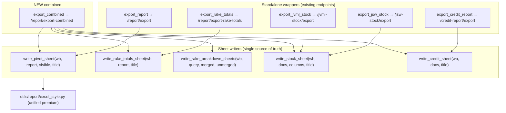

# Report Multi-Sheet Export — Spec & Action Plan

**Date:** 2026-06-26 · **Branch:** `feat/format-agnostic-ingestion` (new work) · **Owner:** report domain

---

## 1. Goal

Clicking **Export** on `/report` opens a **sheet-picker dialog**. The user ticks which
sheets they want; one premium `.xlsx` is produced containing exactly those sheets.
All 7 sheet types get a premium, professional, consistent visual redesign — the same
writers power both this combined export **and** the existing standalone page exports.

Only `/report` changes. The standalone JSW / JVML / Credit page exports stay one-click
(but inherit the premium redesign).

---

## 2. Sheet catalogue (picker options → output sheets)

| Picker option | Icon (lucide) | Output sheet(s) | Sheet name(s) | Source |
|---|---|---|---|---|
| Branch Wise Pivot Report | `LayoutGrid` | 1 | `BRANCH WISE PIVOT REPORT` | `export.py` pivot (reused) |
| Total Rake Report | `TrainTrack` | 1 | `TOTAL RAKE REPORT` | `export_totals.py` totals (reused, merged to 1 sheet) |
| Rake Breakdown Merged | `Combine` | N (1/rake) | `{RAKE} - Merged` | `rake_drilldown` `merged_rows` |
| Rake Breakdown Unmerged | `Rows3` | N (1/rake) | `{RAKE} - Unmerged` | `rake_drilldown` `rows` |
| JSW Stock List | `Boxes` | 1 | `JSW Stock` | `export_jsw_stock` (reused) |
| JVML Stock List | `Boxes` | 1 | `JVML Stock` | `export_jvml_stock` (reused) |
| Credit Report | `CreditCard` | 1 | `Credit Report` | `export_credit_report` (reused) |

**Conditional options:** JSW shown only when `report_type ∈ {jsw, both}`; JVML only when
`report_type ∈ {jvml, both}`. If `report_type=jsw` → no JVML option, and vice-versa.

**Defaults:** all visible options pre-checked. "Export" disabled if zero selected.

---

## 3. Edge cases & rules

- **Excel sheet-name limits:** ≤31 chars, may not contain `[ ] : * ? / \`, must be unique
  within the workbook. Rake sheets run through `safe_sheet_name(base, used_set)`:
  strip illegal chars → truncate to 31 (reserving room for ` - Merged`/` - Unmerged`
  suffix → rake base truncated to ~20) → append `~2`,`~3` on collision.
- **Many rakes:** 8 rakes × (merged+unmerged) = 16 sheets + others. No hard cap; a
  `# ponytail:` note marks per-rake Mongo query as the known cost ceiling (batch later if slow).
- **Empty rake:** a rake with no matching stock rows → still emit the sheet with an
  "(no rows)" note, or skip it. **Decision:** skip empty rake sheets (cleaner file).
- **Stock exports are report_type-independent** (they query `JswStock`/`JvmlStock` by
  date+region). Backend stays permissive — it produces any requested sheet; the FE
  is what hides irrelevant options.
- **`sheets` empty / all** — empty ⇒ 400 (nothing to export); FE prevents this.
- The latent `Worksheet` unimported-annotation in `export.py` is left as-is (safe via
  `from __future__ import annotations`); new modules import `Worksheet` properly.

---

## 4. Backend architecture

### 4.1 Principle — extract "sheet writers", reuse everywhere (no duplication)

Every existing `export_*` today does *create-workbook → write-sheet → style → save-bytes*.
Split that: **writers** take an existing `Workbook`/`Worksheet` and write one styled sheet;
thin **wrappers** create a 1-sheet workbook and return bytes. Standalone exports = wrapper;
combined export = call writers in sequence on one workbook.



### 4.2 File-level changes

| File | Change |
|---|---|
| `utils/report/excel_style.py` | Extend: brand palette + `safe_sheet_name()` + flat-list helpers (`write_premium_table(ws, headers, rows, formats)`). Becomes the **one** styling module. |
| `utils/shared/stock_columns_export.py` *(new)* | `write_stock_sheet(wb, docs, columns, title)` — kills the JSW/JVML duplication. |
| `services/report/export.py` | Extract `write_pivot_sheet(wb, report, visible, title)`; `export_report` calls it. |
| `services/report/export_totals.py` | Extract `write_rake_totals_sheet(wb, report, title)` → **one** sheet (RAKE table + Transport-Mode table stacked). `export_rake_totals` calls it. |
| `services/report/rake_breakdown_export.py` *(new)* | `write_rake_breakdown_sheets(wb, query, *, merged, unmerged)` — enumerate unique rakes, run drilldown per rake, write sheets. |
| `services/report/export_combined.py` *(new)* | `export_combined(query) -> bytes` orchestrator. |
| `services/jsw_stock/export.py` | `export_jsw_stock` now = thin wrapper over `write_stock_sheet`. |
| `services/jvml_stock/export.py` | Same. |
| `services/credit_report/export.py` | Extract `write_credit_sheet(wb, docs, title)`; wrapper calls it. |
| `schemas/report.py` | `CombinedExportQuery(ReportQuery)` adds `sheets: str` (CSV). |
| `controllers/report.py` | `export_combined_controller`. |
| `routes/report.py` | `GET /report/export-combined`. |

### 4.3 New endpoint contract

```
GET /report/export-combined
  ?date=dd-mm-yyyy        (required)
  &report_type=jsw|jvml|both   (required)
  &days=include|exclude|only   (required)
  &region_id=<id>         (optional)
  &columns=<csv>          (optional, pivot column toggles — same as /report/export)
  &sheets=<csv of: pivot,rake_totals,rake_merged,rake_unmerged,jsw,jvml,credit>  (required, non-empty)
→ 200 StreamingResponse  application/vnd...sheet
   Content-Disposition: attachment; filename="report_combined_{report_type}_{date}.xlsx"
   400 if sheets empty or contains an unknown key (whitelist).
```

### 4.4 Combined build flow

```mermaid
sequenceDiagram
  participant C as controller
  participant X as export_combined
  participant G as generate_report
  participant D as rake_drilldown
  C->>X: query (incl. sheets set)
  X->>X: wb = Workbook(); remove default sheet
  alt pivot or rake_totals requested
    X->>G: generate_report(query)  (once)
    G-->>X: ReportResponse (rows, rake_totals, rake_columns)
  end
  opt pivot
    X->>X: write_pivot_sheet(wb, report, visible, "BRANCH WISE PIVOT REPORT")
  end
  opt rake_totals
    X->>X: write_rake_totals_sheet(wb, report, "TOTAL RAKE REPORT")
  end
  opt rake_merged / rake_unmerged
    loop each unique rake
      X->>D: drilldown(rake)
      D-->>X: rows + merged_rows
      X->>X: write "{rake} - Merged" / "{rake} - Unmerged" (skip if empty)
    end
  end
  opt jsw
    X->>X: fetch JswStock docs → write_stock_sheet(wb, ..., "JSW Stock")
  end
  opt jvml
    X->>X: fetch JvmlStock docs → write_stock_sheet(wb, ..., "JVML Stock")
  end
  opt credit
    X->>X: fetch CreditReport docs → write_credit_sheet(wb, ..., "Credit Report")
  end
  X-->>C: bytes
```

---

## 5. Premium Excel design system (`/invoke-design`)

One visual language, applied to every sheet. JSW-branded, high-contrast, no "AI slop".

| Token | Value | Use |
|---|---|---|
| Brand band | JSW blue `#0B5394` | title banner fill |
| Header | slate-900 `#0F172A`, white bold Calibri 11 | column header row |
| Zebra alt | `#F8FAFC` | every 2nd data row |
| Subtotal | `#E2E8F0` bold | group subtotals (pivot) |
| Grand total | slate-800 `#1E293B` white bold + double top border | grand total row |
| Negative | red `#DC2626` | negative balances |
| Positive | green `#059669` | available credit |
| Blocked | red bold | blocked status |

**Every sheet gets:** merged **title banner** row 1–2 (`{Sheet purpose}` + subtitle =
`Report Date · Region · Days filter · Exported {ts}`), premium **header row**, **zebra**
body, **frozen** header (+ left key cols on wide sheets), **auto-filter**, domain
**number formats** (qty `#,##0`, INR `₹ #,##0`, pct `0.000`, dates `dd-mm-yyyy`),
**auto-sized** columns (clamped 10–50), **print setup** (landscape A4, fit-to-width).
Rake-breakdown + totals sheets carry an emphasized **total row**.

Net: retire the basic `utils/shared/export_style.py` look for JSW/JVML/Credit; all route
through the unified premium `excel_style.py`. (`customer_code` export left on basic for
now — out of scope, noted as follow-up.)

---

## 6. Frontend architecture

```mermaid
graph LR
  BTN["Export btn (ReportToolbar)"] -->|openExportDialog| H["useReport"]
  H --> DLG["ExportSheetsDialog (new)"]
  DLG -->|confirm(selected[])| H
  H --> API["exportCombined(params, sheets) (new api)"]
  API --> DL["downloadFromFetch (existing blob→anchor)"]
  DL --> EP["GET /report/export-combined"]
```

| File | Change |
|---|---|
| `components/report/ExportSheetsDialog.tsx` *(new)* | Dialog with icon + checkbox per option; conditional JSW/JVML by `reportType`; default all checked; "Export" CTA. Built from `ui/dialog`, `ui/checkbox`, `ui/button`, lucide icons. |
| `api/report/export-combined.ts` *(new)* | `exportCombined(params, sheets)` → `downloadFromFetch`. |
| `components/report/hooks/useReport.ts` | Replace direct export with `exportDialogOpen` state + `openExportDialog()` + `confirmExport(sheets)`; keep `exporting` flag. |
| `components/report/ReportToolbar.tsx` | Export button → `openExportDialog`. |
| `pages/report/index.tsx` | Render `<ExportSheetsDialog>` wired to hook state. |
| `types/report/report.ts` | `ExportSheetKey` union + `CombinedExportParams`. |

Standalone JSW/JVML/Credit page export paths: **unchanged** (still one-click) — they just
inherit the premium sheet redesign via the shared writers.

---

## 7. Task list (execution order)

**Phase A — Backend styling foundation**
- [ ] A1. Extend `excel_style.py`: brand palette, `safe_sheet_name`, `write_premium_table` flat-list helper. Self-check: `__main__` asserts sheet-name sanitize/truncate/dedupe.
- [ ] A2. New `utils/shared/stock_columns_export.py::write_stock_sheet`.

**Phase B — Refactor standalone exports to writers (keep endpoints green)**
- [ ] B1. `export.py`: extract `write_pivot_sheet`; `export_report` delegates.
- [ ] B2. `export_totals.py`: extract `write_rake_totals_sheet` (1 sheet, 2 tables); delegate.
- [ ] B3. `jsw_stock/export.py` + `jvml_stock/export.py` → call `write_stock_sheet`.
- [ ] B4. `credit_report/export.py`: extract `write_credit_sheet`; delegate.
- [ ] B5. Run existing `test_report_export.py` + stock/credit export tests → all green.

**Phase C — Rake breakdown + combined**
- [ ] C1. `rake_breakdown_export.py::write_rake_breakdown_sheets` (enumerate rakes, per-rake drilldown, skip empty, safe names).
- [ ] C2. `export_combined.py::export_combined`.
- [ ] C3. `CombinedExportQuery` schema + `sheets` whitelist validation.
- [ ] C4. `export_combined_controller` + `GET /report/export-combined` route.
- [ ] C5. Tests: `test_report_export_combined.py` — sheet selection, names, sanitize, empty-skip, conditional stock.

**Phase D — Frontend**
- [ ] D1. `types/report/report.ts`: `ExportSheetKey`, `CombinedExportParams`.
- [ ] D2. `api/report/export-combined.ts`.
- [ ] D3. `ExportSheetsDialog.tsx` (premium, icons, conditional, a11y).
- [ ] D4. `useReport.ts` dialog state + `confirmExport`.
- [ ] D5. `ReportToolbar.tsx` + `pages/report/index.tsx` wiring.
- [ ] D6. `npm run lint` + `tsc -b` green.

**Phase E — Verify & docs**
- [ ] E1. Backend tests green; build one real combined file, open it, eyeball every sheet type.
- [ ] E2. Confirm standalone exports still work + now premium.
- [ ] E3. Update `services/report/CLAUDE.md`, `components/report/CLAUDE.md`, dox root index.

---

## 8. Locked decisions (2026-06-26)
- **TOTAL RAKE REPORT** = RAKE totals table only (Transport-Mode totals dropped from this sheet).
- **Brand** = JSW blue banner (`#0B5394`) + slate-900 header.
- **Empty rakes** = still emit the sheet with a "(no rows)" note (full rake coverage).
- **customer_code export** = migrate to premium too (now in scope → Phase B6).

## 9. Out of scope / deferred
- Per-rake Mongo query batching (note left in code).
- Rake breakdown respecting `report_type` (keeps current both-collections behaviour).
