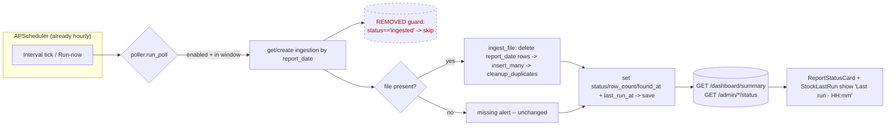

# Plan: Hourly idempotent re-ingestion + "last run at" indicator

## Context

**Problem (user-reported):** ingestion runs once per day, then ignores every later run — new
party codes / items added to the SAP file later in the day never get picked up.

**Audit root cause (verified in source):** the scheduler is *not* the problem. APScheduler
already fires each domain's poll job **hourly** (`interval_hours=1` is the default in all three
config models). The blocker is a guard in every poller:

```python
if ingestion.status == "ingested":      # jsw poller.py:101-103, jvml :102-104
    return await get_status()            # credit poller.py:47-48 (flat), zone_polling.py:187-190 (per-zone)
```

The `*_ingestion` record is keyed on a **unique `report_date`** and is never deleted (cleanup
only removes files, never DB rows). So tick #1 ingests + sets `status="ingested"`; ticks
#2…#N bail. Persistence is **already idempotent** — `ingest_file` does
`Model.find({report_date}).delete()` then `insert_many` (full per-date snapshot) + a
`cleanup_duplicates` pass. The missing-file branch *already* re-runs every tick by design,
so removing the guard does **not** introduce alert spam — it only un-skips the success path.

**Outcome:** during the daily window the poll re-ingests today's file every hour. Each run is a
snapshot refresh of `report_date` → new parties/items appear, removed rows vanish, changed
values update, duplicates impossible. A new `last_run_at` timestamp is surfaced on the
dashboard + settings UI so users can confirm hourly re-runs are happening.

## Decisions (locked with user)

1. **Write strategy = snapshot refresh.** Keep the existing delete-then-insert per date. Do
   *not* add insert-only-new or business-key upsert. Core change = remove 4 guard sites.
2. **Frontend = add a "last run at" indicator** (dashboard cards + settings status panel).
3. Side benefit: removing the guard also fixes the **dead JSW/JVML "Run now" button** (it was
   blocked after first ingest because `run_poll()` has no `force` bypass).

## Architecture



---

## Phase 1 — Backend: remove the skip guards (behavioral core)

Snapshot refresh already exists; just stop skipping. Each tick re-runs `ingest_file`.

| File | Change |
|------|--------|
| `backend/app/services/jsw_stock/poller.py:101-103` | **Delete** the `if ingestion.status == "ingested": return await get_status()` block. |
| `backend/app/services/jvml_stock/poller.py:102-104` | **Delete** the identical block. |
| `backend/app/services/credit_report/poller.py` (`_run_flat`, ~L47-48) | **Delete** `if ingestion.status == "ingested" and not force: return`. |
| `backend/app/services/credit_report/zone_polling.py:187-190` | **Delete** the `if not force and zone_already_ingested(...): continue` skip so every region re-ingests each tick. |

**Do NOT touch** the missing-file / alert branches (they already re-run hourly with their own
`alerted_at` dedupe — preserve exactly).

### Phase 1b — remove resulting dead code (`dead-code-and-change-audit`)
After the guards are gone, `force` (credit only) and `zone_already_ingested` become unused.
- `grep -rn "force" backend/app/services/credit_report/` and `grep -rn "zone_already_ingested" backend/app/`.
- Remove the now-dead `force` param from credit `run_poll` / `_run_flat` / `run_regions` and its call sites (incl. `controllers/credit_report_config.py` run-now, which passes `force=True`), and delete `zone_already_ingested` (`zone_polling.py:62-70`) **iff** grep shows zero remaining real uses. If any test references them (`tests/test_credit_report_zone_ingestion.py`), update that test in Phase 3.
- JSW/JVML have no `force` plumbing — nothing to clean there.

---

## Phase 2 — Backend: `last_run_at` field (set every tick, expose to API)

**Models** — add one optional field (backward-compatible; old docs → `None`, no migration):
- `backend/app/models/jsw_stock_ingestion.py`, `jvml_stock_ingestion.py`, `credit_report_ingestion.py`:
  add `last_run_at: datetime | None = None` to each `*Ingestion` Document (document-level, not the zone embed).

**Pollers** — stamp it on every executed poll, using the existing local-naive `datetime.now()`
convention (matches `found_at`/`alerted_at`, **not** the UTC `created_at`):
- JSW `poller.py`: after the get-or-create block (after L99), add `ingestion.last_run_at = now` (`now` already defined L77). Every save branch (success/error/missing) then persists it.
- JVML `poller.py`: same, after its get-or-create (after L100).
- Credit `poller.py` `_run_flat`: set `ingestion.last_run_at = datetime.now()` just before the final `await ingestion.save()` (~L81).
- Credit `zone_polling.py` `roll_up`: set `ingestion.last_run_at = datetime.now()` alongside the existing `updated_at` stamp (~L121) — covers scheduled + single-zone run.

**Status read-path** — expose a scalar (FastAPI serializes `datetime` → ISO string by default,
no encoder needed):
- Schemas: add `last_run_at: datetime | None = None` to `JswStockStatusPublic` (`schemas/jsw_stock_config.py`), `JvmlStockStatusPublic` (`schemas/jvml_stock_config.py`), `CreditReportStatusPublic` (`schemas/credit_report_config.py`).
- Services: in each `status.py::get_status`, map `last_run_at=latest.last_run_at` from the latest doc (next to the existing `last_found_at` mapping).
- Dashboard: add `last_run_at: datetime | None = None` to `DashboardReportStatus` (`schemas/dashboard.py`) and map `last_run_at=ingestion.last_run_at` in `services/dashboard/summary.py::_report_status` (~L91-104; `None` when no doc).

Recent[] row DTOs are **not** changed (scalar is enough — keep the diff minimal).

---

## Phase 3 — Tests (TDD, DB-free, mock style of `test_report_export_route.py`)

Guard-removal is poller behavior → assert the second poll re-ingests.

**New: `backend/tests/test_jsw_stock_poller_rerun.py`** (JSW is representative; JVML identical).
Red→green: written first it FAILS today (guard skips → `ingest_file` not called); after Phase 1 it PASSES.

```python
"""run_poll re-ingests even when today is already 'ingested' (guard removed) and stamps last_run_at."""
from types import SimpleNamespace
from unittest.mock import AsyncMock
import pytest
from app.services.jsw_stock import poller

@pytest.mark.asyncio
async def test_rerun_ingests_when_already_ingested(tmp_path, monkeypatch):
    cfg = SimpleNamespace(enabled=True, base_path=str(tmp_path),
                          file_name="ZSD_CURRSTK_HR.xlsx", start_time="00:00", end_time="23:59")
    rec = SimpleNamespace(report_date="01-01-2026", status="ingested", row_count=5,
                          found_at=None, alerted_at=None, file_path=None,
                          updated_at=None, last_run_at=None, error=None,
                          save=AsyncMock())
    monkeypatch.setattr(poller.JswStockConfig, "find_one", AsyncMock(return_value=cfg))
    monkeypatch.setattr(poller.JswStockIngestion, "find_one", AsyncMock(return_value=rec))
    ingest = AsyncMock(return_value=7)
    monkeypatch.setattr(poller, "ingest_file", ingest)
    monkeypatch.setattr(poller, "resolve_report_file", lambda folder, name: str(tmp_path / name))
    monkeypatch.setattr(poller, "get_status", AsyncMock(return_value="STATUS"))

    out = await poller.run_poll()

    ingest.assert_awaited_once()          # FAILS before guard removal (proves the bug/fix)
    assert rec.status == "ingested" and rec.row_count == 7
    assert rec.last_run_at is not None    # Phase 2 stamp
    assert out == "STATUS"
```

Also: re-run the **full** suite (`pytest`) to catch fallout from Phase 1b (esp.
`test_credit_report_zone_ingestion.py` if it touched `force`/`zone_already_ingested`); fix any
breakage in-place.

---

## Phase 4 — Frontend: "last run at" indicator

Envelope auto-unwraps generic `T` (`api/client.ts` `getData<T>`), so adding the field to the TS
types is enough for it to flow through typed. No api/hook changes needed.

**Types** (add `last_run_at: string | null`):
- `frontend/src/types/dashboard/summary.ts` → `DashboardReportStatus`.
- `frontend/src/components/settings/types.ts` → `StockStatus` (shared structural type).
- `frontend/src/types/settings/jsw-stock-config.ts` → `JswStockStatus`; `jvml-stock-config.ts` → `JvmlStockStatus`; `credit-report-config.ts` → `CreditReportStatus`.

**Render** (match the existing date-fns local-helper pattern — no shared util exists):
- `frontend/src/components/settings/StockLastRun.tsx`: add a `<Stat label="Last run at" value={fmtDateTime(status.last_run_at)} />` in the `<dl>` grid (~L77-96), reusing the file's existing `fmtDateTime` (`format(parseISO(iso), "dd MMM, HH:mm")`). Covers all 3 settings cards.
- `frontend/src/components/dashboard/ReportStatusCard.tsx`: add a small `Last run · {format(new Date(report.last_run_at), "HH:mm")}` line in `CardContent` after the status `<p>` (~L165), guarded on `report.last_run_at` (match the existing `found_at` format usage at L39).

**Verify** `npm run build` (tsc) + `npm run lint` clean.

---

## Phase 5 — Docs & memory (Phase 7 of lifecycle)

- Update `backend/app/services/jsw_stock/CLAUDE.md` (+ jvml + credit_report local CLAUDE.md) and
  `backend/app/services/dashboard/CLAUDE.md`: note pollers now re-ingest hourly (snapshot
  refresh; guard removed) and stamp `last_run_at`.
- Update `backend/app/models/CLAUDE.md` (new `last_run_at` field) and re-sync the root dox index:
  `python3 ~/.claude/hooks/dox_engine.py sweep .`.
- Copy this approved plan into the repo: `plan-2026-06-28-hourly-idempotent-ingestion.md` (root)
  + `docs/superpowers/plans/2026-06-28-hourly-idempotent-ingestion.md`.
- Memory: update `[[report-step6-qa-hold-aging]]`-adjacent notes with a new memory
  "ingestion-hourly-snapshot-refresh" (guard removed; delete-then-insert per date each hour;
  `last_run_at` surfaced) and that `force`/`zone_already_ingested` were removed.

---

## Verification (end-to-end)

1. **Unit:** `cd backend && ./.venv/bin/python -m pytest tests/test_jsw_stock_poller_rerun.py -v` → PASS; then full `./.venv/bin/python -m pytest` → green.
2. **Backend live:** start server (`./run.sh`), point a JSW config at a folder with today's file, trigger `POST /admin/jsw-stock/run-now` **twice**; confirm: 2nd call still returns row_count (not skipped), `jsw_stock` collection row count is stable (no doubling), and `GET /admin/jsw-stock/status` + `GET /dashboard/summary` show an advancing `last_run_at`.
3. **Run-now fix:** confirm JSW/JVML "Run now" now works after the day is already ingested.
4. **Frontend:** `cd frontend && npm run build && npm run lint`; load `/admin/settings` + `/home`, confirm "Last run at" renders and updates after a run-now.
5. **No regressions:** missing-file day still alerts (unchanged); `grep` confirms zero dead `force`/`zone_already_ingested` refs.

## Risks

| Risk | Mitigation |
|------|------------|
| Removing `force` breaks credit run-now or a test | grep-verify all refs; update call sites + `test_credit_report_zone_ingestion.py` in Phase 1b/3 before claiming done. |
| Hourly delete-then-insert briefly empties today's rows (ms window) | Acceptable at this scale (hundreds–thousands rows/day, hourly); existing behavior on missing days already. No change. |
| `last_run_at` tz inconsistency vs `created_at` (UTC) | Intentionally use naive-local `datetime.now()` to match `found_at`/`alerted_at` (the window clock, BE-14). |
| Adding `last_run_at` to shared structural `StockStatus` must match all 3 branded types | Add to all four type defs in Phase 4 (tsc will catch a miss). |
```
