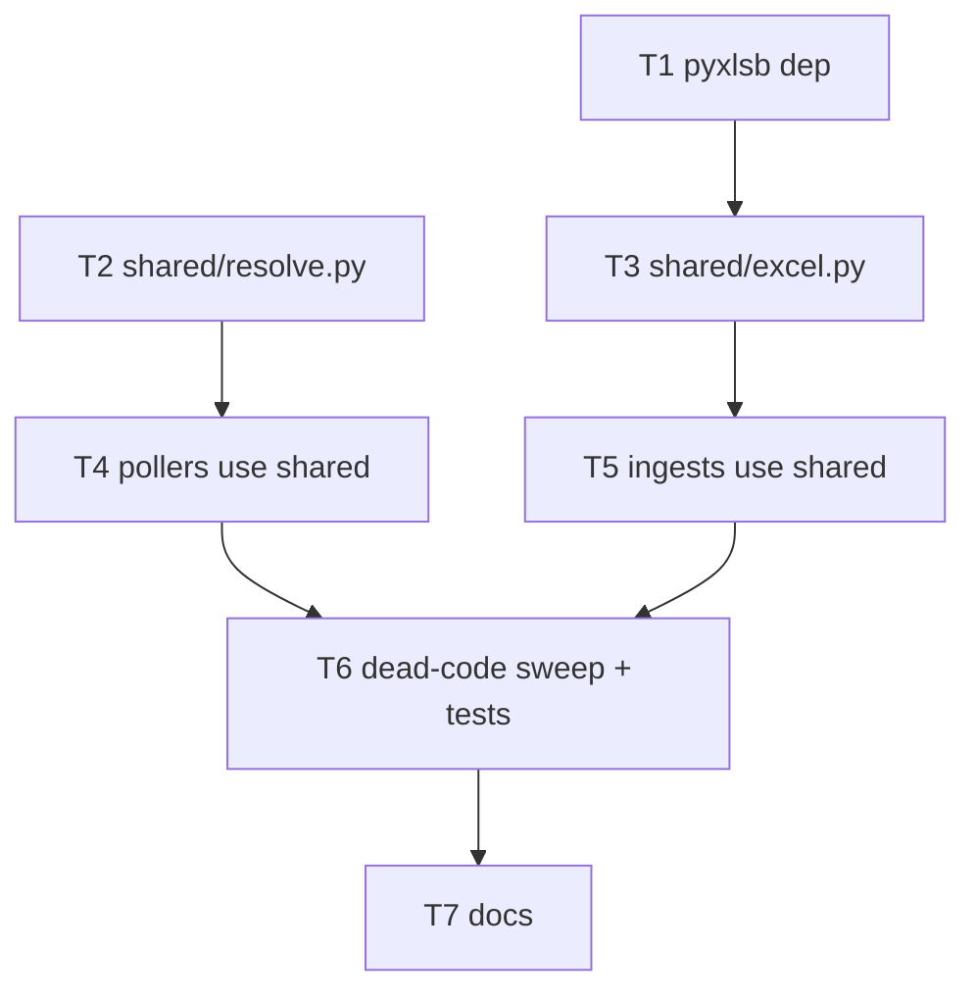

# Format-Agnostic Excel Ingestion — Implementation Plan

> **For agentic workers:** REQUIRED SUB-SKILL: superpowers:subagent-driven-development or superpowers:executing-plans. Steps use `- [ ]` checkboxes.

**Goal:** Stop dropping non-`.xlsx` SAP exports as "missing" — ingest `.xlsx`, `.xlsm`, and `.xlsb` for all three report pollers (credit, jsw_stock, jvml_stock).

**Architecture:** Two `.xlsx`-only chokepoints are duplicated ×3 each. Consolidate both into `utils/shared/`: one content-detecting `parse_workbook` dispatcher (OOXML via existing stdlib zip parser; `.xlsb` via `pyxlsb`) + one `resolve_report_file` that matches the configured stem against any Excel extension. The 3 services keep only their domain `columns.py` (header map + coerce). Detection is by **file content (magic bytes), not extension** — the root cause was a misleading extension.

**Tech Stack:** Python 3.13, FastAPI, stdlib `zipfile`/`xml.etree`, **+`pyxlsb`** (new). `.xls` (OLE2) intentionally NOT supported.

---

## Root cause (from audit)

1. `_resolve_report_file()` (×3 pollers) matches only `ext.lower() == ".xlsx"` → `.xlsb`/`.xlsm` resolve to `None` → poller records **"missing"**. *This is the reported symptom.*
2. `parse_workbook()` (×3 `utils/*/excel.py`) is a zip+XML parser for OOXML only. `.xlsb` is a zip of **binary `.bin`** parts → `KeyError`/empty even if resolved. So resolver-only fix would flip *missing* → *error*. **Both layers must change.**

## Decisions (locked with user)

- Formats: **xlsx + xlsm + xlsb** (+`pyxlsb`). No `.xls`.
- **Consolidate** resolver + parser into `utils/shared/`.

## File structure

```
backend/
  requirements.txt                      MODIFY  + pyxlsb
  app/utils/shared/
    resolve.py                          CREATE  resolve_report_file()
    excel.py                            CREATE  parse_workbook() dispatcher + _parse_ooxml + _parse_xlsb
  app/utils/{credit_report,jsw_stock,jvml_stock}/excel.py   DELETE (logic moves to shared)
  app/utils/{...}/columns.py            KEEP    (HEADER_TO_FIELD, normalize_header, coerce_value)
  app/services/{credit_report,jsw_stock,jvml_stock}/poller.py   MODIFY  use shared resolver, drop _resolve_report_file
  app/services/{...}/ingest.py          MODIFY  call shared parse_workbook(data, HEADER_TO_FIELD, normalize_header)
  tests/utils/shared/test_excel.py      CREATE  xlsx + xlsb parse parity
  tests/utils/shared/test_resolve.py    CREATE  resolver matches each ext
```

`utils/customer_code/excel.py` (admin upload, different signature) is **out of scope** — untouched.

## Dependency graph



---

## Phase 1: Shared modules (foundation)

### Task 1: Add `pyxlsb` dependency

**Files:** Modify `backend/requirements.txt`

- [ ] **Step 1:** Add line after `openpyxl==3.1.5`:
```
pyxlsb==1.0.10
```
- [ ] **Step 2:** Install into the project venv (never system Python):
```bash
cd backend && ./.venv/bin/pip install -r requirements.txt
```
Expected: `Successfully installed pyxlsb-1.0.10`.
- [ ] **Step 3:** Verify import:
```bash
backend/.venv/bin/python -c "import pyxlsb; print(pyxlsb.__name__)"
```
Expected: `pyxlsb`.
- [ ] **Step 4:** Commit. `git add backend/requirements.txt && git commit -m "build: add pyxlsb for .xlsb ingestion"`

### Task 2: `utils/shared/resolve.py`

**Files:** Create `backend/app/utils/shared/resolve.py`, `backend/tests/utils/shared/test_resolve.py`

- [ ] **Step 1: Write failing test** `tests/utils/shared/test_resolve.py`:
```python
import os
import pytest
from app.utils.shared.resolve import resolve_report_file

@pytest.mark.parametrize("ext", [".xlsx", ".XLSX", ".xlsm", ".xlsb"])
def test_resolves_each_excel_ext(tmp_path, ext):
    p = tmp_path / f"REPORT{ext}"
    p.write_bytes(b"x")
    assert resolve_report_file(str(tmp_path), "REPORT") == str(p)

def test_unknown_ext_not_resolved(tmp_path):
    (tmp_path / "REPORT.csv").write_bytes(b"x")
    assert resolve_report_file(str(tmp_path), "REPORT") is None

def test_priority_prefers_xlsx_over_xlsb(tmp_path):
    (tmp_path / "R.xlsb").write_bytes(b"x")
    (tmp_path / "R.xlsx").write_bytes(b"x")
    assert resolve_report_file(str(tmp_path), "R").endswith(".xlsx")

def test_missing_returns_none(tmp_path):
    assert resolve_report_file(str(tmp_path), "NOPE") is None
```
- [ ] **Step 2: Run, expect FAIL** (module missing): `cd backend && ./.venv/bin/python -m pytest tests/utils/shared/test_resolve.py -v`
- [ ] **Step 3: Implement** `app/utils/shared/resolve.py`:
```python
"""Resolve a configured report stem to a real file, extension-agnostic.

The poller stores only a file *stem* (no extension). SAP exports may arrive as
.xlsx / .xlsm / .xlsb and a Linux filesystem is case-sensitive, so a hard-coded
".xlsx" misses everything else. Match the stem against any known Excel extension
(case-insensitive), preferring xlsx > xlsm > xlsb when several exist.
"""
from __future__ import annotations

import os

# Ordered by preference when multiple files share the stem.
EXCEL_EXTS: tuple[str, ...] = (".xlsx", ".xlsm", ".xlsb")


def resolve_report_file(folder: str, file_name: str) -> str | None:
    """Return the path to ``<file_name>.<excel-ext>`` inside *folder*, or None.

    Single directory scan; stem matched exactly, extension compared lower-cased
    against EXCEL_EXTS. Among multiple matches, EXCEL_EXTS order wins.
    """
    try:
        entries = os.listdir(folder)
    except OSError:
        return None

    matches: dict[str, str] = {}
    for entry in entries:
        stem, ext = os.path.splitext(entry)
        ext_l = ext.lower()
        if stem == file_name and ext_l in EXCEL_EXTS and ext_l not in matches:
            matches[ext_l] = os.path.join(folder, entry)

    for ext in EXCEL_EXTS:
        if ext in matches:
            return matches[ext]
    return None
```
- [ ] **Step 4: Run, expect PASS.** (add `backend/tests/utils/shared/__init__.py` if the suite needs package dirs — mirror existing `tests/` layout.)
- [ ] **Step 5: Commit.** `feat: extension-agnostic report file resolver`

### Task 3: `utils/shared/excel.py` (content-detecting parser)

**Files:** Create `backend/app/utils/shared/excel.py`, `backend/tests/utils/shared/test_excel.py`

- [ ] **Step 1: Write failing test** `tests/utils/shared/test_excel.py` — parse the SAME 2-column sheet from an `.xlsx` and an `.xlsb` fixture, assert identical field dicts:
```python
import openpyxl, io
import pytest
from app.utils.shared.excel import parse_workbook

H2F = {"party code": "party_code", "qty": "qty"}
def _norm(h): return " ".join(str(h).split()).strip().lower()

def _xlsx_bytes():
    wb = openpyxl.Workbook(); ws = wb.active
    ws.append(["Party Code", "Qty"]); ws.append(["0008451", "1.057.000"]); ws.append(["8001", 42])
    bio = io.BytesIO(); wb.save(bio); return bio.getvalue()

def test_xlsx_parses(): 
    rows = parse_workbook(_xlsx_bytes(), H2F, _norm)
    assert rows == [{"party_code": "0008451", "qty": "1.057.000"}, {"party_code": "8001", "qty": 42.0}]

def test_xlsb_matches_xlsx(xlsb_fixture_bytes):  # fixture: same data saved as .xlsb
    rows = parse_workbook(xlsb_fixture_bytes, H2F, _norm)
    assert [r["party_code"] for r in rows] == ["0008451", "8001"]

def test_xls_rejected():
    with pytest.raises(ValueError):
        parse_workbook(b"\xd0\xcf\x11\xe0junk", H2F, _norm)
```
Generate the `.xlsb` fixture once (committed under `tests/fixtures/`): on a machine with Excel/LibreOffice, or `backend/.venv/bin/python -c "import pyxlsb"`-readable file — save the same 2-col sheet as `sample.xlsb`. Provide `xlsb_fixture_bytes` via a `conftest.py` fixture reading that file. *(If producing a real `.xlsb` is impractical in this env, mark `test_xlsb_matches_xlsx` `@pytest.mark.skipif(not fixture_exists)` and verify `.xlsb` manually against a real SAP export in Task 6 — note the gap, do not silently drop it.)*
- [ ] **Step 2: Run, expect FAIL** (module missing).
- [ ] **Step 3: Implement** `app/utils/shared/excel.py`:
```python
"""Format-agnostic Excel parser shared by all report ingestion services.

Dispatches by workbook CONTENT (not extension — the resolved file may carry a
misleading extension):

  * OOXML  (.xlsx / .xlsm) -> stdlib zipfile + iterparse. No openpyxl: tolerant
    of malformed numeric cells like "1.057.000" (kept as raw str).
  * BIFF12 (.xlsb)         -> pyxlsb.

Both paths return identical [{field_name: raw_value}] dicts (raw — caller applies
coerce_value from its columns.py). Columns are identical across formats; only the
container encoding differs. Legacy .xls (OLE2) is NOT supported.
"""
from __future__ import annotations

import io
import zipfile
import xml.etree.ElementTree as ET
from typing import Any, Callable

HeaderMap = dict[str, str]
Normalizer = Callable[[Any], str]


def _strip_ns(tag: str) -> str:
    return tag.rpartition("}")[2] if "}" in tag else tag


def _col_index(ref: str) -> int:
    letters = ""
    for ch in ref:
        if ch.isalpha():
            letters += ch
        else:
            break
    idx = 0
    for ch in letters:
        idx = idx * 26 + (ord(ch.upper()) - ord("A") + 1)
    return idx - 1


def _read_shared_strings(zf: zipfile.ZipFile) -> list[str]:
    try:
        xml_bytes = zf.read("xl/sharedStrings.xml")
    except KeyError:
        return []
    shared: list[str] = []
    for si in ET.fromstring(xml_bytes):
        if _strip_ns(si.tag) == "si":
            shared.append("".join(
                c.text for c in si.iter() if _strip_ns(c.tag) == "t" and c.text
            ))
    return shared


def _parse_ooxml(data: bytes, header_to_field: HeaderMap, normalize_header: Normalizer) -> list[dict[str, Any]]:
    """Stream-parse OOXML (.xlsx/.xlsm). Lifted verbatim from the former
    jsw_stock/excel.py iterparse parser (memory-safe for 17k+ rows via
    elem.clear()), with HEADER_TO_FIELD/normalize_header now passed in."""
    zf = zipfile.ZipFile(io.BytesIO(data))
    shared = _read_shared_strings(zf)
    # locate the first worksheet part (sheet1.xml is the SAP convention)
    ws_name = next(
        (n for n in zf.namelist() if n.startswith("xl/worksheets/") and n.endswith(".xml")),
        "xl/worksheets/sheet1.xml",
    )
    col_map: dict[int, str] = {}
    header_done = False
    rows: list[dict[str, Any]] = []
    cur_row: dict[int, Any] = {}
    cur_type: str | None = None
    cur_ref: str = ""
    with zf.open(ws_name) as fh:
        for event, elem in ET.iterparse(fh, events=("start", "end")):
            tag = _strip_ns(elem.tag)
            if event == "start":
                if tag == "row":
                    cur_row = {}
                elif tag == "c":
                    cur_type = elem.get("t")
                    cur_ref = elem.get("r", "")
            else:
                if tag == "v":
                    raw_v = elem.text or ""
                    if cur_type == "s":
                        val: Any = shared[int(raw_v)]
                    elif cur_type in ("str", "b"):
                        val = raw_v
                    else:
                        try:
                            val = float(raw_v)
                        except (ValueError, TypeError):
                            val = raw_v
                    if cur_ref:
                        cur_row[_col_index(cur_ref)] = val
                elif tag == "t" and cur_type == "inlineStr":
                    if cur_ref:
                        ci = _col_index(cur_ref)
                        cur_row[ci] = str(cur_row.get(ci, "")) + (elem.text or "")
                elif tag == "row":
                    if not header_done:
                        for ci, v in cur_row.items():
                            field = header_to_field.get(normalize_header(v))
                            if field:
                                col_map[ci] = field
                        header_done = True
                    else:
                        mapped = {col_map[ci]: v for ci, v in cur_row.items() if ci in col_map}
                        if any(v is not None and v != "" for v in mapped.values()):
                            rows.append(mapped)
                    cur_row = {}
                elem.clear()
    return rows


def _parse_xlsb(data: bytes, header_to_field: HeaderMap, normalize_header: Normalizer) -> list[dict[str, Any]]:
    """Parse BIFF12 (.xlsb) via pyxlsb. First worksheet; row 0 = headers."""
    from pyxlsb import open_workbook  # local import: only loaded for .xlsb

    rows: list[dict[str, Any]] = []
    with open_workbook(io.BytesIO(data)) as wb:
        with wb.get_sheet(1) as sheet:  # pyxlsb sheets are 1-indexed
            col_map: dict[int, str] = {}
            for r_i, row in enumerate(sheet.rows()):
                cells = {c.c: c.v for c in row}  # c.c = col index, c.v = value
                if r_i == 0:
                    for ci, v in cells.items():
                        if v is None:
                            continue
                        field = header_to_field.get(normalize_header(v))
                        if field:
                            col_map[ci] = field
                    continue
                mapped = {col_map[ci]: v for ci, v in cells.items() if ci in col_map}
                if any(v is not None and v != "" for v in mapped.values()):
                    rows.append(mapped)
    return rows


def parse_workbook(
    data: bytes,
    header_to_field: HeaderMap,
    normalize_header: Normalizer,
) -> list[dict[str, Any]]:
    """Detect container by content and parse → [{field: raw_value}]."""
    if not data:
        return []
    if zipfile.is_zipfile(io.BytesIO(data)):
        names = zipfile.ZipFile(io.BytesIO(data)).namelist()
        if any(n.startswith("xl/worksheets/") and n.endswith(".xml") for n in names):
            return _parse_ooxml(data, header_to_field, normalize_header)
        if any(n.startswith("xl/worksheets/") and n.endswith(".bin") for n in names):
            return _parse_xlsb(data, header_to_field, normalize_header)
        raise ValueError("Unrecognized zip workbook: no xl/worksheets/*.xml or *.bin part")
    # ponytail: re-open BytesIO per check (is_zipfile + namelist + parse). Trivial
    # for in-memory bytes; collapse to a single ZipFile open if profiling says so.
    raise ValueError("Unsupported workbook format (legacy .xls / non-Excel not supported)")
```
- [ ] **Step 4: Run, expect PASS** (xlsx + reject tests; xlsb test passes if fixture present).
- [ ] **Step 5: Commit.** `feat: content-detecting shared Excel parser (xlsx/xlsm/xlsb)`

### Checkpoint A
- [ ] `pytest tests/utils/shared -v` green (xlsb may be skip-with-note pending real fixture).
- [ ] `pyxlsb` importable from `backend/.venv`.

---

## Phase 2: Wire services to shared, delete duplicates

### Task 4: Pollers use shared resolver (×3)

**Files:** Modify `app/services/{credit_report,jsw_stock,jvml_stock}/poller.py`

- [ ] **Step 1:** In each poller, delete the `def _resolve_report_file(...)` block.
- [ ] **Step 2:** Add import: `from ...utils.shared.resolve import resolve_report_file`.
- [ ] **Step 3:** Replace the call site `_resolve_report_file(folder, cfg.file_name)` → `resolve_report_file(folder, cfg.file_name)`.
- [ ] **Step 4:** Remove now-unused `os.path.splitext`/`os.listdir` usage if it was only for the deleted helper (keep `os` if still used elsewhere — grep first).
- [ ] **Step 5: Verify** no dangling refs: `cd backend && ./.venv/bin/python -c "import app.services.jsw_stock.poller, app.services.jvml_stock.poller, app.services.credit_report.poller"` → no ImportError.
- [ ] **Step 6: Commit.** `refactor: pollers use shared extension-agnostic resolver`

### Task 5: Ingests use shared parser; delete 3 service excel.py

**Files:** Modify `app/services/{...}/ingest.py`; Delete `app/utils/{credit_report,jsw_stock,jvml_stock}/excel.py`

- [ ] **Step 1:** In each `ingest.py`, change the import:
  - from `from ...utils.<svc>.excel import parse_workbook`
  - to `from ...utils.shared.excel import parse_workbook` **and** ensure `normalize_header` + `HEADER_TO_FIELD` are imported from that service's `columns.py` (check existing imports; jsw already imports `coerce_value`/`COLUMNS` from `.columns` — add the two if absent).
- [ ] **Step 2:** Change the call `parse_workbook(raw_bytes)` → `parse_workbook(raw_bytes, HEADER_TO_FIELD, normalize_header)`.
- [ ] **Step 3:** Delete the 3 files `app/utils/{credit_report,jsw_stock,jvml_stock}/excel.py`.
- [ ] **Step 4: Verify** import health: `cd backend && ./.venv/bin/python -c "import app.services.credit_report.ingest, app.services.jsw_stock.ingest, app.services.jvml_stock.ingest"`.
- [ ] **Step 5: Commit.** `refactor: ingests use shared parser; remove 3 duplicate excel parsers`

### Checkpoint B
- [ ] App imports clean: `cd backend && ./.venv/bin/python -c "import app.main"` (or the app factory module).
- [ ] `grep -rn "_resolve_report_file\|utils\.\(credit_report\|jsw_stock\|jvml_stock\)\.excel" backend/app` → **no hits**.

---

## Phase 3: Sweep, verify, document

### Task 6: Dead-code sweep + regression tests

- [ ] **Step 1:** Confirm `customer_code/excel.py` still imported by `services/customer_code/import_rows.py` (it is — leave it). Confirm the 3 `columns.py` still imported (coerce/COLUMNS) — they are.
- [ ] **Step 2:** Run full suite: `cd backend && ./.venv/bin/python -m pytest -q`. Fix any test that imported a deleted path.
- [ ] **Step 3:** End-to-end smoke per report type: drop a real `.xlsb` SAP export named `<configured_stem>.xlsb` into the watched folder, trigger the poller's `run-now`, confirm status flips `missing`→`ingested` and `row_count` matches the xlsx baseline. Record the row counts. *(This closes any xlsb-fixture gap from Task 3.)*
- [ ] **Step 4:** `./.venv/bin/python -m pytest -q` green; commit `test: shared excel/resolver coverage + xlsb e2e`.

### Task 7: Docs

- [ ] **Step 1:** Create/refresh `backend/app/utils/shared/CLAUDE.md`: document `resolve.py` (extension priority) + `excel.py` (content dispatch, supported formats, why pyxlsb, why not openpyxl, .xls unsupported).
- [ ] **Step 2:** Update `backend/app/utils/{credit_report,jsw_stock,jvml_stock}/CLAUDE.md` (excel.py removed → parser is shared) and the 3 `services/*/poller.py` dir docs (shared resolver).
- [ ] **Step 3:** Update root `CLAUDE.md` "Domain data gotchas" — replace the "cannot be read with openpyxl … raw-zip parser" note with the shared content-detecting parser supporting xlsx/xlsm/xlsb.
- [ ] **Step 4:** Re-sync dox index: `python3 ~/.claude/hooks/dox_engine.py sweep .`
- [ ] **Step 5:** Add an auto-memory note (format-agnostic ingestion: shared resolver+dispatcher, +pyxlsb, content-detected). Commit `docs: format-agnostic ingestion`.

### Checkpoint C (Done)
- [ ] All formats: `.xlsx` and `.xlsb` of the same report produce equal row counts.
- [ ] `missing` no longer reported for a present `.xlsb`.
- [ ] Full pytest green; app imports clean; 3 duplicate parsers + 3 resolver copies gone.

---

## Risks & mitigations

| Risk | Impact | Mitigation |
|------|--------|------------|
| `.xlsb` sheet index / header row differs from `.xlsx` | Med | Task 3 + Task 6 assert xlsb≡xlsx field dicts on real export |
| Producing an `.xlsb` test fixture in this env | Low | Skip-with-note in Task 3; mandatory real-export e2e in Task 6 (no silent gap) |
| pyxlsb returns dates as float serials where xlsx gives text | Low | `coerce_value` already normalizes; verify date cols (`LC Exp Date`) in e2e |
| A poller used `os` only for the deleted helper | Low | grep before removing the `import os` |

## Out of scope
`.xls` (OLE2/xlrd); `customer_code` admin-upload parser; changing column maps or coercion.
